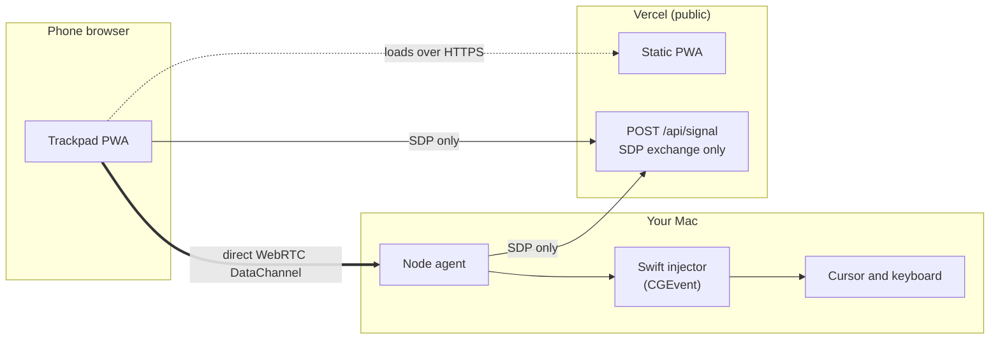
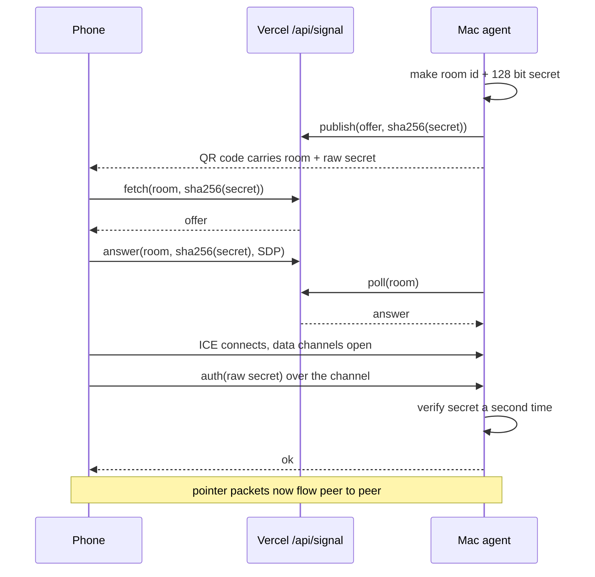

# phone-mouse

Turn your phone into a precision trackpad and keyboard for your Mac. Open a web
page on the phone, run a small agent on the Mac, and drive the cursor. The phone
and the Mac talk directly, peer to peer, so your movements never travel through
a server.

```
one finger drag = move    tap = click    two fingers = scroll / right click
hold = drag lock          Kbd = type from the phone keyboard
```

Live page: https://phone-mouse-psi.vercel.app

## How it works

The web page is only the input surface. It is hosted on Vercel, but nothing on
Vercel can move a cursor, so a small local agent does the actual input injection.
The two negotiate a direct [WebRTC](https://developer.mozilla.org/docs/Web/API/WebRTC_API)
data channel and then talk straight to each other. Vercel carries only the few
hundred bytes of handshake, never the pointer stream.



## Why WebRTC, not a plain WebSocket

The obvious design is to serve the page and open a `ws://192.168.x.x` socket to
the Mac. It does not work: a page served over HTTPS is hard blocked from opening
an insecure socket to a LAN IP (mixed content), and only `localhost` counts as a
secure origin, not arbitrary LAN addresses.

WebRTC solves both problems at once. Its DTLS transport counts as a secure
context, so HTTPS is satisfied, and on a LAN the peers resolve to host candidates
and connect directly, typically 2 to 5 ms round trip. A cloud relay would have
added 40 to 100 ms, which for a cursor is the entire product.

Two data channels carry the traffic:

- `ctrl`, reliable and ordered, for auth, clicks, keystrokes, and telemetry.
- `input`, unreliable and unordered, for movement and scroll. A dropped move
  packet is superseded a frame later, and retransmitting it would stall every
  packet behind it. That head of line blocking is the usual reason these apps
  feel laggy.

## Quickstart

Requires macOS with the Xcode command line tools (for `swiftc`) and Node 20+.

```bash
git clone https://github.com/karimbabasf/phone-mouse.git
cd phone-mouse/agent
npm install
npm start
```

`npm start` compiles the Swift injector, starts the agent, and prints a QR code.
Scan it with your phone. The pairing link carries a 128 bit secret and expires
after three minutes; the agent issues a fresh one automatically.

To point the agent at your own deployment instead of the hosted page:

```bash
PM_SIGNAL_URL=https://your-app.vercel.app npm start
```

### One time: Accessibility permission

macOS blocks synthetic input until the process posting it is trusted. Without it,
the events are dropped silently: the agent pairs and reports no error while the
cursor does not move.

Grant it under System Settings > Privacy & Security > Accessibility, to the
terminal you run `npm start` from (Terminal, iTerm, VS Code, and so on), then
restart the agent. macOS usually prompts on first run.

## Gestures

| Input | Action |
| --- | --- |
| One finger drag | Move pointer |
| Tap | Left click |
| Two finger tap | Right click |
| Two finger drag | Scroll |
| Hold, then drag | Drag lock |
| Tap, then tap and hold | Drag lock |
| Kbd button | Keyboard passthrough |

The pointer uses a nonlinear acceleration curve: near 1 to 1 when your finger
moves slowly for precision, saturating toward a large gain on a flick so you can
cross the screen in one swipe. `Sens` scales it, `Natural` flips scroll direction.

## Pairing and security



The signaling server only ever sees `sha256(secret)`. The raw secret travels in
the QR code and is checked again by the agent over the data channel. A fully
compromised signaling server therefore cannot drive your Mac: it never holds a
value it could replay. Pairing records are one shot and expire after 180 seconds.
The agent opens no listening port; it dials out.

## Testing

Three harnesses, no physical phone required for the first two:

```bash
# Signaling protocol against production, including the rejection paths
node scripts/test-signal.mjs

# Is Accessibility actually granted? Moves the cursor 60px and back.
node scripts/test-injector.mjs

# Full loopback: plays the phone on the Mac through real signaling,
# proving handshake, auth, and data flow end to end.
cd agent && node test-e2e.mjs
```

## Status and limits

The transport, signaling, and input injection are each verified, including a
loopback harness that completes the full pairing and pushes commands to the
injector. On real devices the direct link needs an actual route between the phone
and the Mac. On a home network or a phone hotspot that just works. Many cafe,
co-working, and guest networks enable client isolation that blocks device to
device traffic, and there is no TURN relay configured yet, so those networks are
not supported. Put both devices on the same permissive network, or use the phone
Personal Hotspot.

## Roadmap

- TURN relay so it works on client isolated networks, with a latency tradeoff.
- Optional Upstash Redis for the signaling store, so the handshake never depends
  on a warm serverless instance (see below).
- Native iOS client if the web input surface hits a feel ceiling.

### Signaling store

`/api/signal` keeps handshake records in instance memory by default, which is
adequate for a single user because the handshake completes in seconds. Set
`UPSTASH_REDIS_REST_URL` and `UPSTASH_REDIS_REST_TOKEN` on the Vercel project to
make it deterministic across instances; the code already branches on their
presence and the agent logs which backend is in use at pairing time.

## Layout

```
agent/
  index.js        WebRTC peer, pairing, routes input to the injector
  injector.swift  CGEvent injection, reads newline delimited JSON on stdin
  test-e2e.mjs    loopback pairing probe
web/
  app/page.tsx            trackpad surface, gestures, acceleration, telemetry
  app/api/signal/route.ts SDP exchange
  lib/store.ts            memory or Upstash backend
scripts/
  test-signal.mjs   signaling protocol test
  test-injector.mjs Accessibility permission check
```

## Stack

Next.js and React for the PWA, deployed on Vercel. Node with
[node-datachannel](https://github.com/murat-dogan/node-datachannel) for the
agent side of WebRTC. A single Swift file using CoreGraphics for input
injection, chosen over a Node native module because the maintained options were
either unpublished or stale, and `swiftc` ships with the Xcode command line
tools.

## License

MIT. See [LICENSE](LICENSE).
