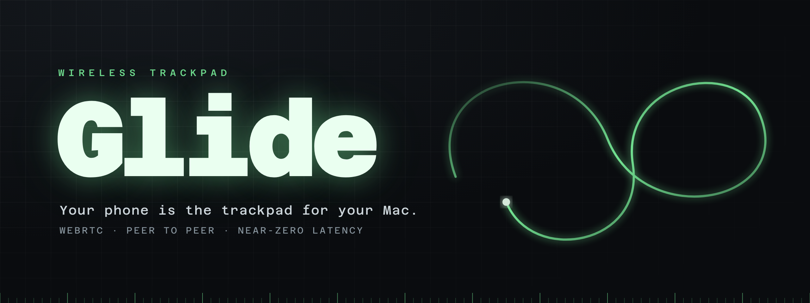
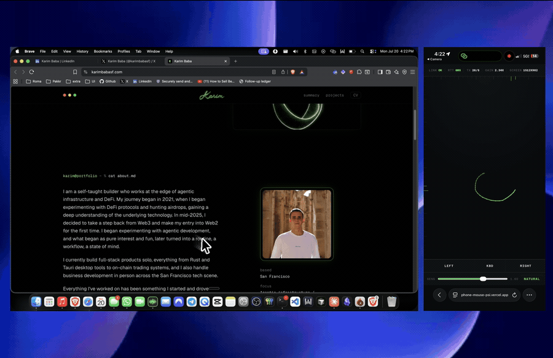
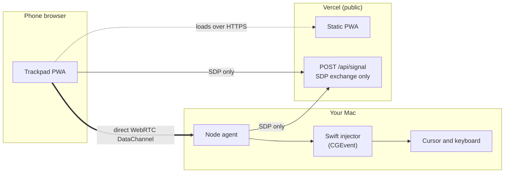
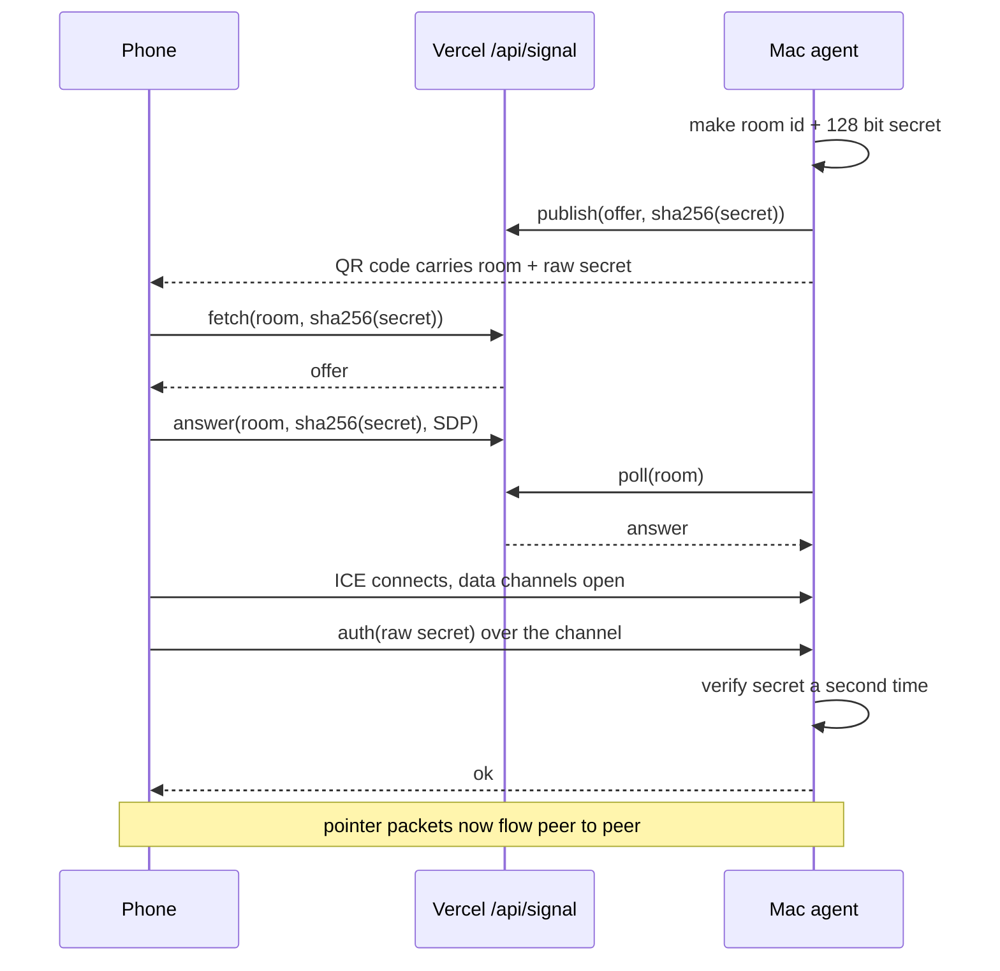

<div align="center">



<br />

**Your phone is the trackpad for your Mac.**

Open a web page on your phone, run a small agent on your Mac, and drive the cursor. The two talk directly, peer to peer, so your movements never travel through a server.

<br />


</div>

<br />

<div align="center">



<sub>The phone is a bare input surface. The green trail is the pad drawing your finger path in real time.</sub>

</div>

<br />

## How it works

The web page is only the input surface. It is hosted on Vercel, but nothing on Vercel can move a cursor, so a small local agent does the actual input injection. The phone and the agent negotiate a direct [WebRTC](https://developer.mozilla.org/docs/Web/API/WebRTC_API) data channel and then talk straight to each other. Vercel carries only the few hundred bytes of handshake, never the pointer stream.



## Why WebRTC, not a plain WebSocket

The obvious design is to serve the page and open a `ws://192.168.x.x` socket to the Mac. It does not work: a page served over HTTPS is hard blocked from opening an insecure socket to a LAN IP (mixed content), and only `localhost` counts as a secure origin, not arbitrary LAN addresses.

WebRTC solves both at once. Its DTLS transport counts as a secure context, so HTTPS is satisfied, and on a LAN the peers resolve to host candidates and connect directly, typically 2 to 5 ms round trip. A cloud relay would have added 40 to 100 ms, which for a cursor is the entire product.

Two data channels carry the traffic:

- `ctrl`, reliable and ordered, for auth, clicks, keystrokes, and telemetry.
- `input`, unreliable and unordered, for movement and scroll. A dropped move packet is superseded a frame later, and retransmitting it would stall every packet behind it. That head of line blocking is the usual reason these apps feel laggy.

## Quickstart

Requires macOS with the Xcode command line tools (for `swiftc`) and Node 20+.

```bash
git clone https://github.com/karimbabasf/glide.git
cd glide/agent
npm install
npm start
```

`npm start` compiles the Swift injector, starts the agent, and prints a QR code. Scan it with your phone. The pairing link carries a 128 bit secret and expires after three minutes; the agent issues a fresh one automatically.

Phone and Mac must be on the same network without client isolation. Home Wi-Fi or a phone hotspot both work; many cafe and co-working networks block device to device traffic (see [Status](#status-and-limits)).

### One time: Accessibility permission

macOS blocks synthetic input until the process posting it is trusted. Without it, the events are dropped silently: the agent pairs and reports no error while the cursor does not move.

Grant it under System Settings > Privacy & Security > Accessibility, to the terminal you run `npm start` from (Terminal, iTerm, VS Code, and so on), then restart the agent. macOS usually prompts on first run.

## Gestures

Modeled on the Apple trackpad, tracked per touch so a two-finger scroll is never confused with a one-finger-held drag.

| Input | Action |
| --- | --- |
| One finger drag | Move pointer |
| Tap | Left click |
| Double tap | Double click |
| Two finger tap | Right click |
| Two finger drag | Scroll |
| Three finger swipe up | Mission Control |
| Three finger swipe down | App Expose |
| Three finger swipe left or right | Switch spaces |
| Hold, or tap then hold, then drag | Drag lock |
| Two fingers, one anchored one moving | Click and drag |
| Kbd button | Keyboard passthrough |

The pointer uses a nonlinear acceleration curve: near 1 to 1 when your finger moves slowly for precision, saturating on a flick so you can cross the screen in one swipe. `Sens` scales it, `Natural` flips scroll direction. Three-finger swipes fire the default macOS keyboard shortcuts, so they follow whatever those are set to.

## Pairing and security



The signaling server only ever sees `sha256(secret)`. The raw secret travels in the QR code and is checked again by the agent over the data channel. A fully compromised signaling server cannot drive your Mac: it never holds a value it could replay. Pairing records are one shot and expire after 180 seconds. The agent opens no listening port; it dials out.

## Testing

Three harnesses, no physical phone required for the first two:

```bash
# Signaling protocol against production, including the rejection paths
node scripts/test-signal.mjs

# Is Accessibility actually granted? Moves the cursor 60px and back.
node scripts/test-injector.mjs

# Full loopback: plays the phone on the Mac through real signaling,
# proving handshake, auth, and data flow end to end.
cd agent && node test-e2e.mjs
```

## Status and limits

The transport, signaling, and input injection are each verified, including a loopback harness that completes the full pairing and pushes commands to the injector. On real devices the direct link needs an actual route between the phone and the Mac. On a home network or a phone hotspot that just works. Many cafe, co-working, and guest networks enable client isolation that blocks device to device traffic, and there is no TURN relay configured yet, so those networks are not supported. Put both devices on the same permissive network, or use the phone Personal Hotspot.

## Roadmap

- TURN relay so it works on client isolated networks, with a latency tradeoff.
- Optional Upstash Redis for the signaling store, so the handshake never depends on a warm serverless instance.
- Native iOS client if the web input surface hits a feel ceiling.

## Layout

```
agent/
  index.js        WebRTC peer, pairing, routes input to the injector
  injector.swift  CGEvent injection, reads newline delimited JSON on stdin
  test-e2e.mjs    loopback pairing probe
web/
  app/page.tsx            trackpad surface, per-touch gesture engine, telemetry
  app/api/signal/route.ts SDP exchange
  lib/store.ts            memory or Upstash backend
scripts/
  test-signal.mjs   signaling protocol test
  test-injector.mjs Accessibility permission check
```

## Stack

Next.js and React for the PWA, deployed on Vercel. Node with [node-datachannel](https://github.com/murat-dogan/node-datachannel) for the agent side of WebRTC. A single Swift file using CoreGraphics for input injection, chosen over a Node native module because the maintained options were either unpublished or stale, and `swiftc` ships with the Xcode command line tools.

## License

MIT. See [LICENSE](LICENSE).
